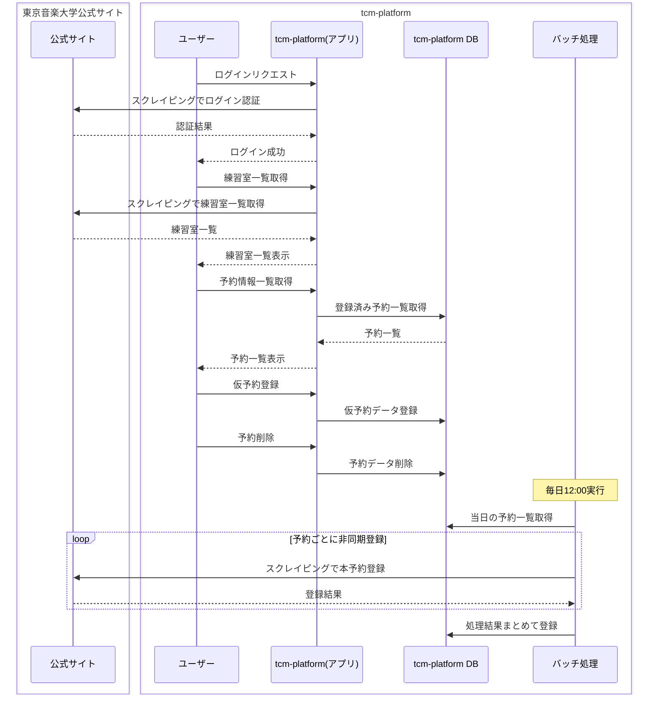

# tcm-platform

東京音楽大学 - 練習室予約サービス

### 概要

Web ブラウザから利用可能な gRPC の技術検証と、Go におけるクリーンアーキテクチャ＋モジュラーモノリス設計の実装アウトプットを目的として開発。

東京音楽大学公式サイトの UX 向上を目的に、友人グループ内での運用を想定。

###### アーキテクチャ

クリーンアーキテクチャ + モジュラーモノリス

###### 通信

gRPC（Connect）

###### フロントエンド

TypeScript / React Router v7 / React Aria / Tailwind CSS

###### バックエンド

Go / sqlc / PostgreSQL

###### スクレイピング

[ekkx/tcmrsv](https://github.com/ekkx/tcmrsv) を自作後、外部パッケージとして利用

###### デプロイ環境

自宅サーバー上の Docker コンテナ
