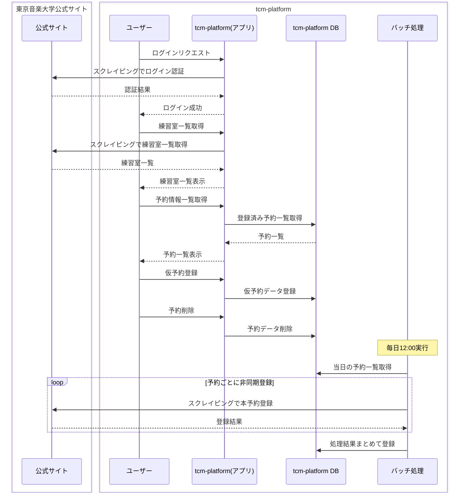

# tcm-platform

東京音楽大学 - 練習室予約サービス

```mermaid
sequenceDiagram
    box 東京音楽大学公式サイト
        participant OfficialSite as 公式サイト
    end

    box tcm-platform
        participant User as ユーザー
        participant TCMApp as tcm-platform(アプリ)
        participant TCMDB as tcm-platform DB
        participant Batch as バッチ処理
    end

    %% ログイン・練習室一覧取得
    User->>TCMApp: ログインリクエスト
    TCMApp->>OfficialSite: スクレイピングでログイン認証
    OfficialSite-->>TCMApp: 認証結果
    TCMApp-->>User: ログイン成功

    User->>TCMApp: 練習室一覧取得
    TCMApp->>OfficialSite: スクレイピングで練習室一覧取得
    OfficialSite-->>TCMApp: 練習室一覧
    TCMApp-->>User: 練習室一覧表示

    %% 予約情報一覧取得
    User->>TCMApp: 予約情報一覧取得
    TCMApp->>TCMDB: 登録済み予約一覧取得
    TCMDB-->>TCMApp: 予約一覧
    TCMApp-->>User: 予約一覧表示

    %% 仮予約登録
    User->>TCMApp: 仮予約登録
    TCMApp->>TCMDB: 仮予約データ登録

    %% 予約削除
    User->>TCMApp: 予約削除
    TCMApp->>TCMDB: 予約データ削除

    %% 毎日12:00 バッチ処理
    Note over Batch: 毎日12:00実行
    Batch->>TCMDB: 当日の予約一覧取得
    loop 予約ごとに非同期登録
        Batch->>OfficialSite: スクレイピングで本予約登録
        OfficialSite-->>Batch: 登録結果
    end
    Batch->>TCMDB: 処理結果まとめて登録
```
